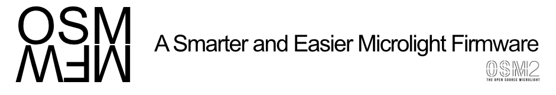

# OSMMFW
The Open Source Microlight Mode Firmware: a firmware for the OSM2 chips that can load modes from OSMModes. The codebase is based off of Neo 2.5.4.

# Mission Statement
Our goal with the OSMMFW, is to create an easy to use ultra dynamic Firmware for the OSM2 chips. We're creating this firmware primarily in the hopes of taking Microlights to the next level.

### Goals
- Structure the source code in practical and consistently named files for ease of editing.
- Write generic functions for heavily reused bits of code and keep the naming conventions consistent.
- Allow parsing of external data files for loading modes, strobe patterns, color palettes, and accelerometer triggers. (This will allow modes to be created without ever having to edit the source code!)

## License
This project is under the [MIT License](LICENSE.md)
© 2015 OSMModes